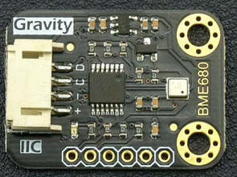

# DFRobot_BME680

* [中文版](./README_CN.md)

BME680 is an integrated environmental sensor developed specifically for mobile applications and wearables 
where size and low power consumption are key requirements. Expanding Bosch Sensortec’s existing family of environmental sensors, 
the BME680 integrates for the first time individual high linearity and high accuracy sensors for gas, pressure, humidity and temperature.

 


## Product Link（[https://www.dfrobot.com/product-1697.html](https://www.dfrobot.com/product-1697.html)）
    SKU: SEN0248

## Table of Contents

* [Summary](#summary)
* [Installation](#installation)
* [Methods](#methods)
* [Compatibility](#compatibility)
* [History](#history)
* [Credits](#credits)

## Summary
The temperature, pressure, humidity at both ends of the sampling resistance of BME680 can be read through I2C.
These data are printed out through the serial port.
1. Low standby current
2. Serial input via I2C-bus

## Installation

This Sensor should work with BME680 on RaspberryPi.<br>
Run the program:
```
$> python read_all_data.py

```

## Methods

```python
    '''!
      @brief Set humidity oversampling
      @param Oversampling value: OS_NONE, OS_1X, OS_2X, OS_4X, OS_8X, OS_16X
    '''
    def set_humidity_oversample(self, value)
    
    '''!
      @brief Set temperature oversampling
      @param Oversampling value: OS_NONE, OS_1X, OS_2X, OS_4X, OS_8X, OS_16X
    '''
    def set_pressure_oversample(self, value)
    
    '''!
      @brief Set pressure oversampling
      @param Oversampling value: OS_NONE, OS_1X, OS_2X, OS_4X, OS_8X, OS_16X
    '''
    def set_temperature_oversample(self, value)
    
    '''!
      @brief Set IIR filter size to remove short term fluctuations from the temperature and pressure readings
      @param  increasing resolution but reducing bandwidth
              FILTER_SIZE_0
              FILTER_SIZE_1
              FILTER_SIZE_3
              FILTER_SIZE_7
              FILTER_SIZE_15
              FILTER_SIZE_31
              FILTER_SIZE_63
              FILTER_SIZE_127
    '''
    def set_filter(self, value)
    
    '''!
      @brief Enable/disable gas sensor
      @param 1 for enable and 0 for disable
    '''
    def set_gas_status(self, value)
    
    '''!
      @brief Set gas sensor heater temperature
      @param value:target temperature in degrees celsius, between 200 ~ 400
    '''
    def set_gas_heater_temperature(self, value)
    
    '''!
      @brief Set gas sensor heater duration
      @param value:target duration in milliseconds, between 1 ~ 4032
    '''
    def set_gas_heater_duration(self, value)
    
    '''!
      @brief Set current gas sensor conversion profile
      @param value:current gas sensor conversion profile: 0 ~ 9
    '''
    def select_gas_heater_profile(self, value)
```

## Compatibility

| 主板         | 通过 | 未通过 | 未测试 | 备注 |
| ------------ | :--: | :----: | :----: | :--: |
| RaspberryPi2 |      |        |   √    |      |
| RaspberryPi3 |      |        |   √    |      |
| RaspberryPi4 |  √   |        |        |      |

* Python 版本

| Python  | 通过 | 未通过 | 未测试 | 备注 |
| ------- | :--: | :----: | :----: | ---- |
| Python2 |  √   |        |        |      |
| Python3 |     |        |    √    |      |

## History

- 2017/12/04 - Version 2.0.0 released.
- 2017/09/04 - Version 1.0.0 released.

## Credits

Written by luoyufeng(yufeng.luo@dfrobot.com), 2017. (Welcome to our [website](https://www.dfrobot.com/))
