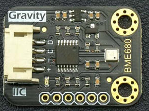

# DFRobot_BME680

* [English Version](./README.md)

BME680 是专为移动应用和可穿戴设备开发的集成环境传感器其中尺寸和低功耗是关键要求。 BME680 扩展了 Bosch Sensortec <br>
现有的环境传感器系列，首次集成了用于气体、压力、湿度和温度的单个高线性度和高精度传感器。<br>

 

## 产品链接（[https://www.dfrobot.com.cn/goods-1621.html](https://www.dfrobot.com.cn/goods-1621.html)）
    SKU: SEN0248

## 目录

  * [概述](#概述)
  * [库安装](#库安装)
  * [方法](#方法)
  * [兼容性](#兼容性)
  * [历史](#历史)
  * [创作者](#创作者)

## 概述
BME680采样电阻两端的温度、压力、湿度可以通过I2C读取。这些数据通过串口打印出来。<br>
此传感器具有以下特点：
1. 低待机电流
2. 通过 I2C 总线的串行输入 

## 库安装
1. 下载库至树莓派，要使用这个库，首先要将库下载到Raspberry Pi，命令下载方法如下:<br>
```python
sudo git clone https://github.com/DFRobot/DFRobot_BME680
```
2. 打开并运行例程，要执行一个例程demo_x.py，请在命令行中输入python demo_x.py。例如，要执行 demo_read_all_data.py例程，你需要输入:<br>

```python
python demo_read_all_data.py 
```

## 方法

```python
    '''!
      @brief 设置湿度采样
      @param value  采样值: OS_NONE, OS_1X, OS_2X, OS_4X, OS_8X, OS_16X
    '''
    def set_humidity_oversample(self, value)
    
    '''!
      @brief 设置压强采样
      @param value  采样值: OS_NONE, OS_1X, OS_2X, OS_4X, OS_8X, OS_16X
    '''
    def set_pressure_oversample(self, value)
    
    '''!
      @brief 设置温度采样
      @param value  采样值: OS_NONE, OS_1X, OS_2X, OS_4X, OS_8X, OS_16X
    '''
    def set_temperature_oversample(self, value)
    
    '''!
      @brief 设置 IIR 滤波器大小以消除温度和压力读数的短期波动
      @param value   提高分辨率但降低带宽
              FILTER_SIZE_0
              FILTER_SIZE_1
              FILTER_SIZE_3
              FILTER_SIZE_7
              FILTER_SIZE_15
              FILTER_SIZE_31
              FILTER_SIZE_63
              FILTER_SIZE_127
    '''
    def set_filter(self, value)
    
    '''!
      @brief Enable/disable gas sensor
      @param value  使能或失能
      @retval    1  使能 
      @retval    0  失能
    '''
    def set_gas_status(self, value)
    
    '''!
      @brief 设置气体传感器加热器温度
      @param value:以摄氏度为单位的目标温度，在 200 ~ 400 之间
    '''
    def set_gas_heater_temperature(self, value)
    
    '''!
      @brief 设置气体传感器加热器持续时间
      @param value：目标持续时间，以毫秒为单位，介于 1 ~ 4032 之间
    '''
    def set_gas_heater_duration(self, value)
    
    '''!
      @brief 设置当前气体传感器转换配置文件
      @param value:当前气体传感器转换配置文件：0 ~ 9
    '''
    def select_gas_heater_profile(self, value)
```

## 兼容性

| 主板         | 通过 | 未通过 | 未测试 | 备注 |
| ------------ | :--: | :----: | :----: | :--: |
| RaspberryPi2 |      |        |   √    |      |
| RaspberryPi3 |      |        |   √    |      |
| RaspberryPi4 |  √   |        |        |      |

* Python 版本

| Python  | 通过 | 未通过 | 未测试 | 备注 |
| ------- | :--: | :----: | :----: | ---- |
| Python2 |  √   |        |        |      |
| Python3 |     |        |    √    |      |

## 历史

- 2017/12/04 - 2.0.0 版本
- 2017/09/04 - 1.0.0 版本

## 创作者

Written by luoyufeng(yufeng.luo@dfrobot.com), 2017. (Welcome to our [website](https://www.dfrobot.com/))


